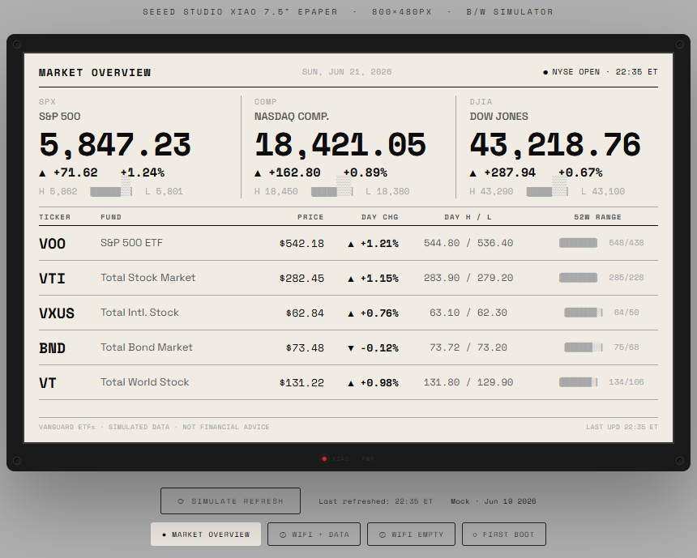

# ePaperTicker

An ESP32 firmware that turns a 7.5" ePaper display into an always-on stock ticker. Fetches live market data over WiFi, renders it to the display, then deep-sleeps until the next refresh — idle power draw is near zero.


*800×480 B/W simulator — market overview with index bar, ticker table, and 52-week range bars*

## Features

- **Captive portal setup** — connect to the device's WiFi hotspot, configure your network credentials, data provider API key, and tickers through a browser. No app required.
- **Two data providers** — Finnhub or Twelve Data (switchable in the portal)
- **API key validation** — the portal tests your key against a real fetch before letting you save
- **Rotation bank** — up to 5 ticker rows on screen at once; individual rows can rotate through a bank of additional tickers each refresh cycle
- **NVS persistence** — config and data cache survive power cycles
- **Graceful degradation** — shows cached data if WiFi or the API is unavailable

## Hardware

| | Board A | Board B |
|---|---|---|
| MCU | Seeed XIAO ESP32-C3 | Seeed reTerminal E1001 |
| Display | Seeed 7.5" ePaper Panel (external) | Internal 7.5" mono ePaper |
| Flash method | esptool via native USB (`usb_reset`) | esptool via CH340 UART |
| Status | **Working** | **Working** |

## Building

Requires [PlatformIO](https://platformio.org/).

```bash
# Board A (XIAO ESP32-C3 + external panel)
pio run -e board-a
pio run -e board-a -t upload --upload-port COM4

# Board B (reTerminal E1001)
pio run -e board-b
pio run -e board-b -t upload --upload-port COM5

# Serial monitor (adjust port as needed)
pio device monitor -p COM4 -b 115200
pio device monitor -p COM5 -b 115200
```

> **Windows note:** Board A uses the ESP32-C3's native USB. First-time setup requires installing the WinUSB driver for Interface 2 of the JTAG device (VID 303A, PID 1001) via [Zadig](https://zadig.akeo.ie). After that, flashing is automatic — no bootloader button sequence needed.

## First boot

On first boot the device starts in Config Mode — it broadcasts a WiFi hotspot named `ePaperTicker-XXXX`. Connect to it and navigate to `192.168.4.1` to complete setup. You'll need:

1. Your WiFi network credentials
2. A free API key from [Finnhub](https://finnhub.io) or [Twelve Data](https://twelvedata.com)
3. The ticker symbols you want to display

## Dependencies

- [GxEPD2](https://github.com/ZinggJM/GxEPD2) — ePaper display driver
- [ArduinoJson](https://arduinojson.org/) — JSON parsing
